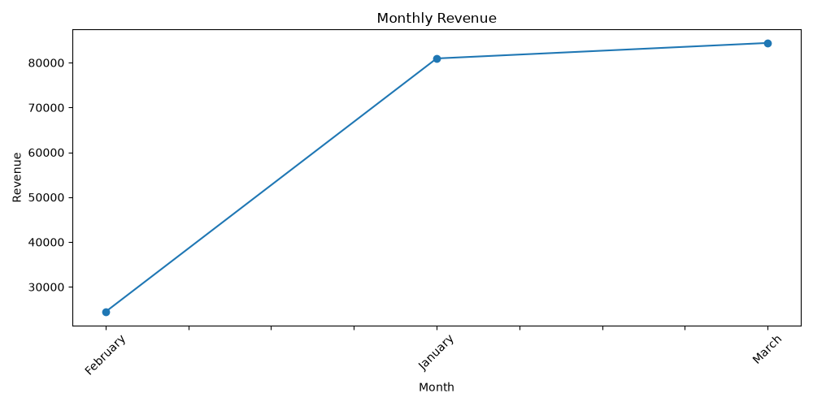
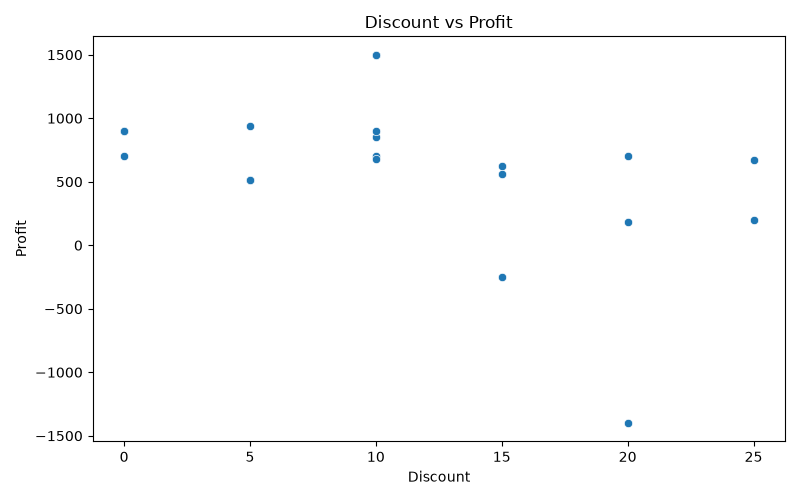
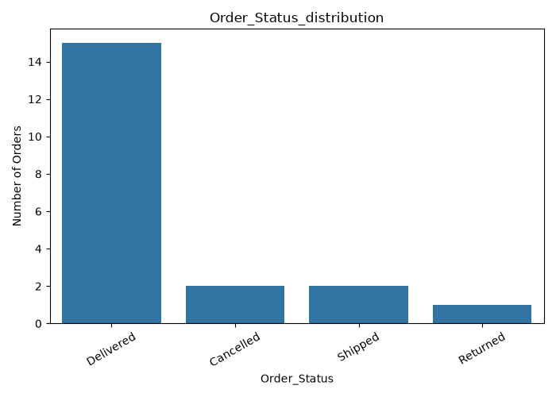
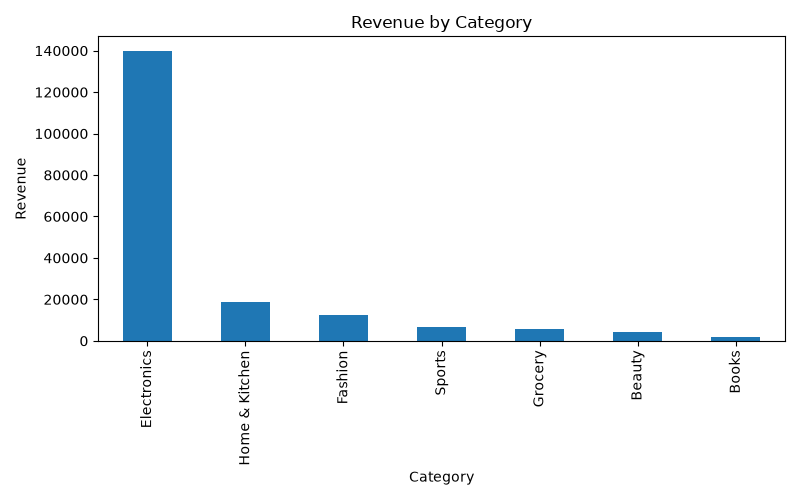
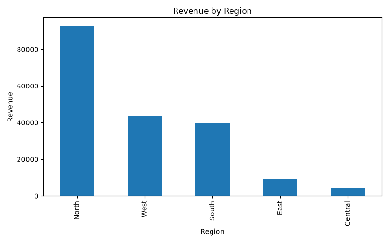
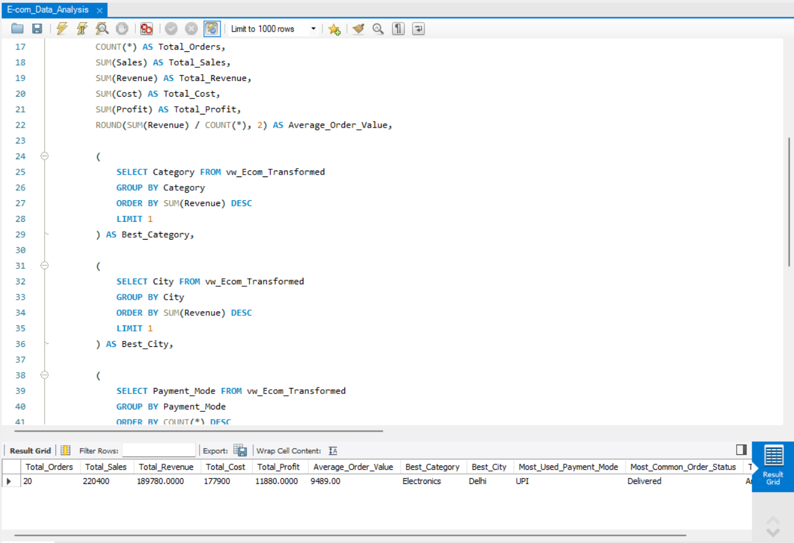

# 🛒 E-commerce Exploratory Data Analysis (EDA) — Multi-Tool Implementation

A comprehensive end-to-end data analysis project exploring e-commerce performance data using **Python**, **MySQL**, and **Power BI**. This repository demonstrates three distinct technical approaches to data cleaning, SQL query execution, statistical analysis, and executive visual reporting on the exact same dataset.

---

## 📊 1. Executive Dashboard (Power BI)

Interactive reporting and KPI visualizations built using Power BI Desktop, DAX measures, and custom Figma dashboard canvas templates.


---

## 🐍 2. Python Exploratory Data Analysis (`/Python`)

Python scripts and notebooks utilizing **Pandas**, **NumPy**, **Matplotlib**, and **Seaborn** for deep statistical analysis, data cleaning, and automated chart generation.

| Monthly Revenue Trend | Discount vs. Profit Analysis |
| :---: | :---: |
|  |  |

| Profit by Category | Order Status Distribution |
| :---: | :---: |
|  |  |

| Revenue by Category | Revenue by Region |
| :---: | :---: |
|  |  |

---

## 🗄️ 3. Relational Database & SQL Analytics (`/MySQL`)

Structured MySQL scripts handling table schema setup, data cleaning, transformations, and complex metric queries using SQL commands, views and stored procedures.



---

## 📂 Repository Structure

```text
├── data/                       # Raw CSV / Excel datasets
├── Python/                     # Python scripts & visualization code
│   ├── Graphs/                 # Generated EDA charts (.png)
│   ├── main.py                 # Primary execution script
│   └── requirements.txt        # Python dependencies
├── MySQL/                      # Sequential SQL scripts
│   ├── E-com_Data_Loader.sql
│   ├── E-com_Data_Cleaning.sql
│   ├── E-com_Data_Transformation.sql
│   └── E-com_Data_Analysis.sql
├── PowerBI/                    # Power BI report (.pbix, .pdf) & layouts
└── screenshots/                # Key project screenshots for documentation
